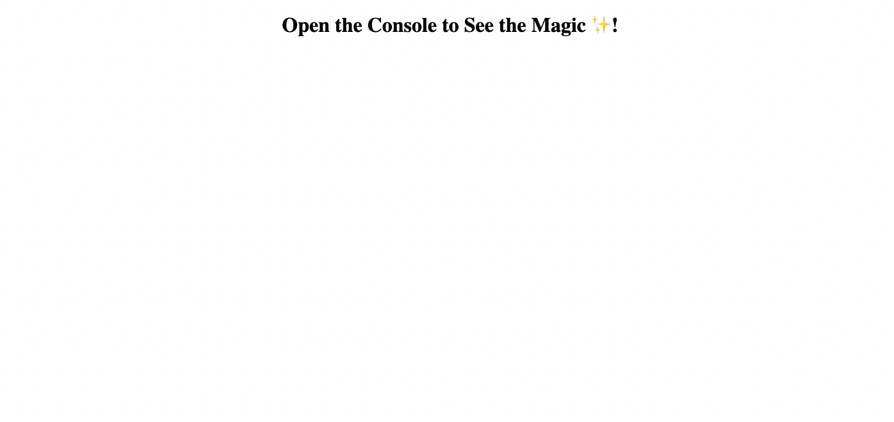

# Console-Finances

## Description

The project consists of a JavaScript file that contains financial information in the form of arrays with two fields: Date and Profit/Losses. When opened in the console using inspect or dev tools, you will be able to see the results of a created code for analyzing the financial records of a company from a provided dataset.

Link to the deployed project:

When opened the page should look like this:

## Installation

N/A

## Usage

The code in the index.js file consists of informative comments that explain the usage of each line. At the beginning of the file, there is an array containing financial records of a company. To view various analyses of the data, open the console from the dev tools on your screen. You will be able to see the following analyses: Number of Months, Total, Average Change, Greatest Increase/Decrease in Profits/Losses.

## Credits

The development of the code process involved leveraging ChatGPT.
Other resources:
www.youtube.com. (n.d.). JavaScript Algorithms - 25 - Quick Sort Solution. [online] Available at: https://www.youtube.com/watch?v=lWLTHsQnHDI&list=PLPHXZAiHKswy7ZlDQcVrzzAbAYh6W10RG&index=8 [Accessed 2 Jan. 2024].

‌

## License

Please refer to the LICENSE in the repo.
